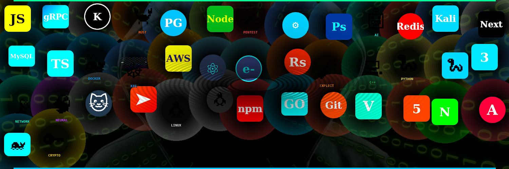

# Hi, SOMEngineer here👋

**SOC Analyst • AI Engineer • Web Developer • Entrepreneur**

  

            *"I build systems that don't call you at 3am 🚨" 

## 🚀About Me

🧑‍💻 About Me

LMT alumni. 28. Dangerously curious.

→ Laying foundations in Full Stack Engineering

→ Pushing into AI — agents, RAG pipelines, the good stuff

→ Moonlighting as a 3D artist & CG worldbuilder

→ Chronic Tech Founder (Soh-Wot?, .arc)

I believe the best engineers are also the best tinkerers.
Everything here is proof of work.

## 🤹Skills

## Languages & Frameworks

## Creative Suite

## 📈Stats 

## 📬 Connect

[Email](mailto:somengineer@tutamail.com) • [Website](https://somengineer.netlify.app/) • [LinkedIn](https://linkedin.com/in/somengineer) • [Twitter](https://twitter.com/somenginr)

